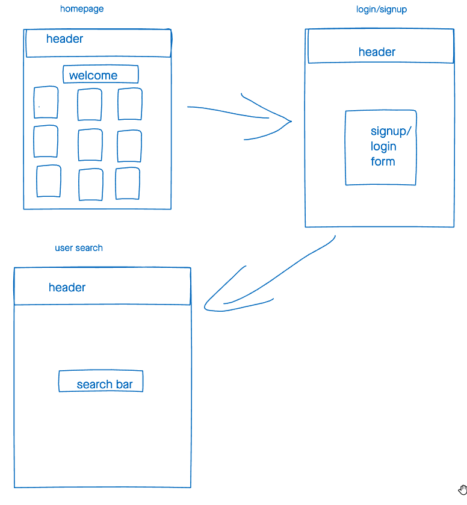

# Book-it
An application used to search Books
## Tech Used
* HTML
* CSS3
* JavaScript
* React.JS
* Node.JS
* Express.JS
* Mongoose.JS
* MongoDB
* Morgan
* New York Times Book API
* GoogleBooks API 
* Google Fonts
* Heroku
## Screenshots
### Original Wireframe

### ERD

### Live App
#### Landing Home Page 
##### Homepage Before Log in

##### Homepage After Log in

## App is Now LIVE!
## [Click Here](https://blooming-cove-90440.herokuapp.com/) to see the app in action!
##### Future Enhancements
###### * Deploy to Perosonal Domain
###### * Add bookstore search
###### * Add user library
###### * Add read/unread option
###### * Add Mailing list or bookclub feature